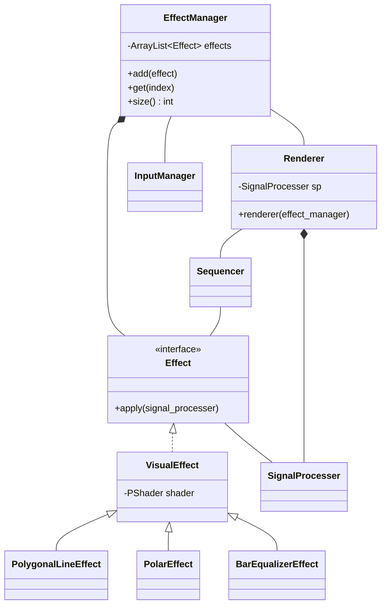

```mermaid
classDiagram
    class Effect {
        <<interface>>
        +apply(signal_processer)
    }
    
    class Renderer {
        -SignalProcesser sp
        
        +renderer(effect_manager)
    }
    
    class EffectManager {
        -ArrayList~Effect~ effects
        
        +add(effect)
        +get(index)
        +size() int
    }
    
    class VisualEffect {
    	-PShader shader
    }
    
    Effect <|.. VisualEffect
    VisualEffect <|-- PolygonalLineEffect
    VisualEffect <|-- PolarEffect
    VisualEffect <|-- BarEqualizerEffect
    Effect -- SignalProcesser
    EffectManager *-- Effect
    EffectManager -- Renderer
    EffectManager -- InputManager
    Renderer *-- SignalProcesser
    Renderer -- Sequencer
    Sequencer -- Effect
```
